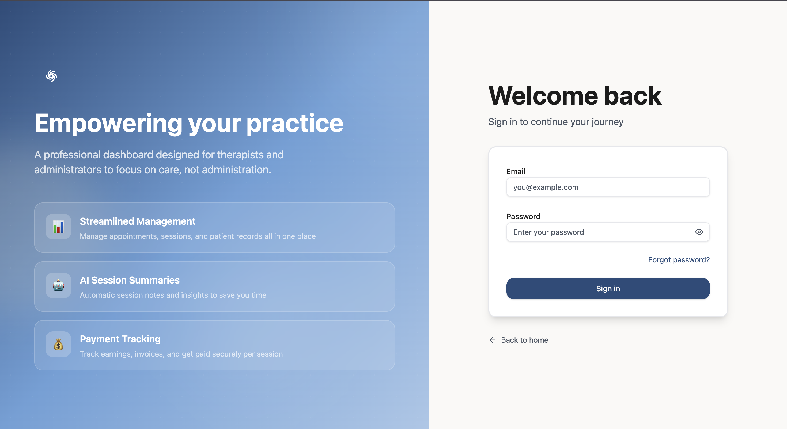
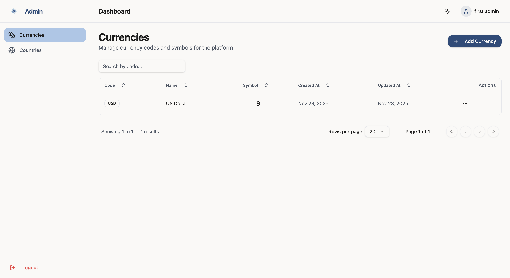
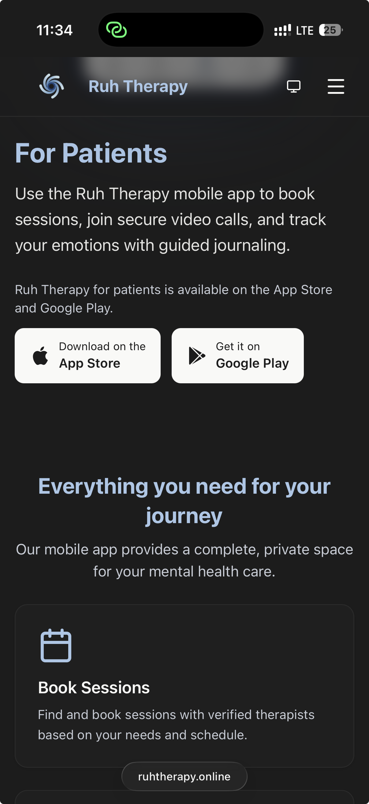

# Ruh Therapy - Web Application

## Project Description

Ruh Therapy is a comprehensive web platform designed to empower mental health professionals and administrators. It serves as a centralized dashboard for managing therapy sessions, patient records, payments, and platform settings. While patients access their care through a dedicated mobile application, this web portal provides the robust infrastructure needed for therapists and admins to focus on care delivery rather than administration.

**Backend Repository:**
This frontend application connects to a NestJS backend. You can find the backend repository here:
[https://github.com/ibrahim-raad/ruh-backend](https://github.com/ibrahim-raad/ruh-backend)

**Key Features:**

- **Role-Based Access Control:** distinct portals for Administrators and Therapists.
- **Authentication:** Secure login with email verification and password reset capabilities.
- **Admin Dashboard:** Management of global settings, currencies, countries, and user accounts.
- **Therapist Dashboard:** (In progress) Session management and patient tracking.
- **Responsive Design:** Modern, accessible UI built with Tailwind CSS and Radix UI.

## Live Demo

You can access the live application here: **[https://ruhtherapy.online](https://ruhtherapy.online)**

## Setup Instructions

To run this project locally, follow these steps:

1.  **Prerequisites:** Ensure you have Node.js (v22+ recommended) installed.
2.  **Clone the repository:**
    ```bash
    git clone https://github.com/ibrahim-raad/ruh-web.git
    cd ruh-web
    ```
3.  **Environment Configuration:**
    Create a `.env` file in the root directory. You must define the API URL:
    ```bash
    VITE_API_URL=http://localhost:3000
    ```
4.  **Install dependencies:**
    ```bash
    npm install
    ```
5.  **Start the development server:**
    ```bash
    npm run dev
    ```
6.  **Open in browser:** Navigate to `http://localhost:5173` (or the port shown in your terminal).

## Docker Support

You can also run the application using Docker.

1.  **Build and run with Docker Compose:**
    Ensure your `.env` file is configured (or pass the variable directly), then run:

    ```bash
    docker-compose up --build
    ```

    _Note: The `docker-compose.yml` maps port `8080` to the container's port `80`._

2.  **Access the application:**
    Navigate to `http://localhost:8080` in your browser.

## Screenshots of the UI

<!-- Instructions: Upload screenshots to a 'screenshots' folder in the root directory and uncomment the lines below. -->

### Landing Page


### Login Screen



### Admin Dashboard



### Mobile View


